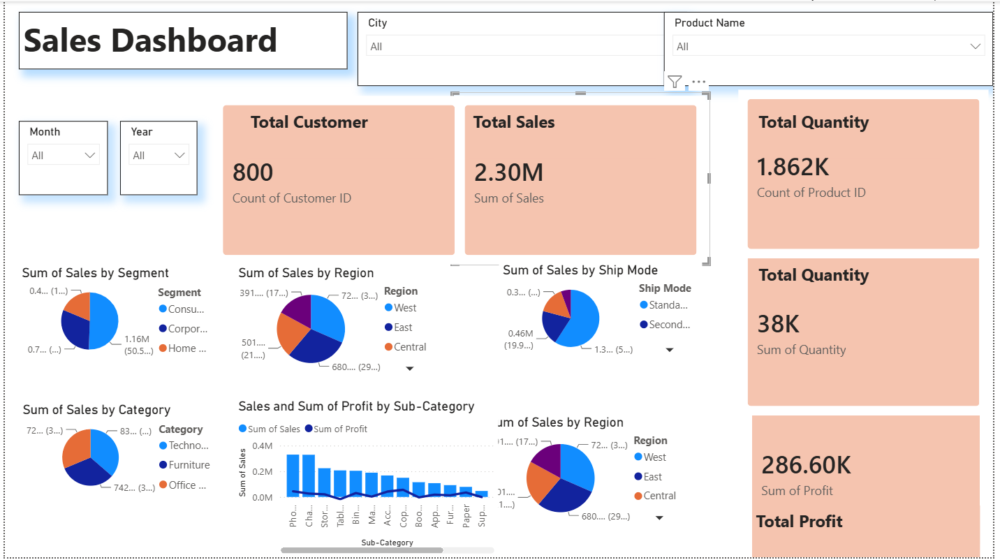

# 📊 Sales Performance Dashboard

## 📌 Project Overview

This project presents an interactive Sales Performance Dashboard developed in Power BI to analyze sales performance, target achievement, and executive productivity across multiple cities.

The dashboard transforms raw sales data into meaningful business insights using KPI cards, interactive filters, and dynamic visualizations to support data-driven decision making.

---

## 🎯 Project Objectives

- Monitor overall sales performance.
- Track target achievement rates.
- Compare executive-wise sales performance.
- Analyze city-level sales metrics.
- Identify performance gaps and improvement opportunities.

---

## 📊 Dashboard Highlights

### KPI Metrics

- Total Sales
- Executive-wise Performance
- Target Achievement %
- Away From Target %

## 📈 Visualizations Included

### Executive-wise Sales Analysis

Compares total sales generated by each sales executive.

### Target Achievement Analysis

Measures how effectively each executive meets assigned targets.

### Away From Target Analysis

Shows the remaining percentage required to achieve targets.

### Performance Comparison Charts

Provides a visual comparison of sales metrics and target performance.

### Interactive Filtering

Dynamic slicers allow users to drill down into city-specific insights.

---

## 🛠 Tools & Technologies

- Power BI
- Power Query
- DAX
- Data Modeling
- Data Visualization

---

## 📚 Key Insights

- Identify top-performing sales executives.
- Compare sales performance across cities.
- Track target completion rates.
- Highlight areas requiring improvement.
- Enable faster business decision making through visual analytics.

---

## 🎓 Skills Demonstrated

- Data Cleaning
- Data Transformation
- Power Query
- DAX
- KPI Development
- Dashboard Design
- Business Intelligence
- Data Visualization

---

## 💼 Business Value

This dashboard helps management:

- Monitor sales performance efficiently.
- Evaluate executive productivity.
- Track sales targets.
- Support strategic decision making.

---

## 🚀 Future Improvements

- Monthly Sales Trend Analysis
- Revenue Forecasting
- Regional Performance Comparison
- Profitability Analysis
- Automated Data Refresh

